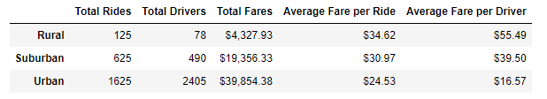

# PyBer_Analysis

### Project Overview

As a new employee at PyBer, a rideshare app company valued at $2.3 billion, I have been given a project to analyze rideshare data from January to early May of 2019 to present to the CEO. I have been informed that she is very demanding about how comprehensive and correct analyses are.

### Resources
- Data Source: ride_data.csv & city_data.csv
- Software: Python 3.7.6, Jupyter Notebook, Pandas, Visual Studio Code 1.74.1, Atom 1.63.1

### Results

The analysis shows that among the three types of cities (urban, suburban and rural), that although urban cities have the overall greatest amount of rides during the timeframe of January through May 2019, rural cities have the highest average fare per ride and the highest average fare per driver.

Rural areas make up 125 of the total rides with 78 total drivers. The total fares rural cities brought in during this time period was $4,327.93 with an average fare per ride of $34.62 and the average fare per driver of $55.49.

Suburban areas make up 625 of the total rides with 490 total drivers. The total fares suburban cities brought in during this time period was $19,356.33 with an average fare per ride of $30.97 and the average fare per driver of $39.50.

Urban areas make up 1,625 of the total rides with 2,405 total drivers. The total fares urban cities brought in during this time period was $39,854.38 with an average fare per ride of $24.53 and the average fare per driver of $16.57.

The line graph shows that the year started off pretty slow and gradually picked up with the week of February 24, 2019 bringing in the highest fares across all three city types. Suburban and rural cities saw a little bit of a lull until April and urban cities stayed consistent for the remainder of the time frame with a couple of mini-peaks afterward.

### Summary

Based on the results, provide three business recommendations to the CEO for addressing any disparities among the city types.

Based on the results of my analysis, I recommend the following
- PyBer should increase recruitment for drivers in rural areas, this will increase the total number of drivers and bring the average fair per ride and driver down to be more equivalent to urban and suburban areas.
- A limit of how many total drivers should be implemented in urban areas. Urban areas have almost 3 times as many drivers per ride as rural areas and twice as many drivers per ride as suburban areas. By limiting the number of drivers in urban areas, this will bring the average fare per ride and average fare per driver to be more equivalent to suburban and rural areas.
- More advertising for rideshare options in rural areas should also increase ridership which will increase the total fares that will be brought in in the area.
- Incentivize urban drivers to go into the suburban areas since ride demand in suburban areas is slightly higher than total drivers can accommodate.
